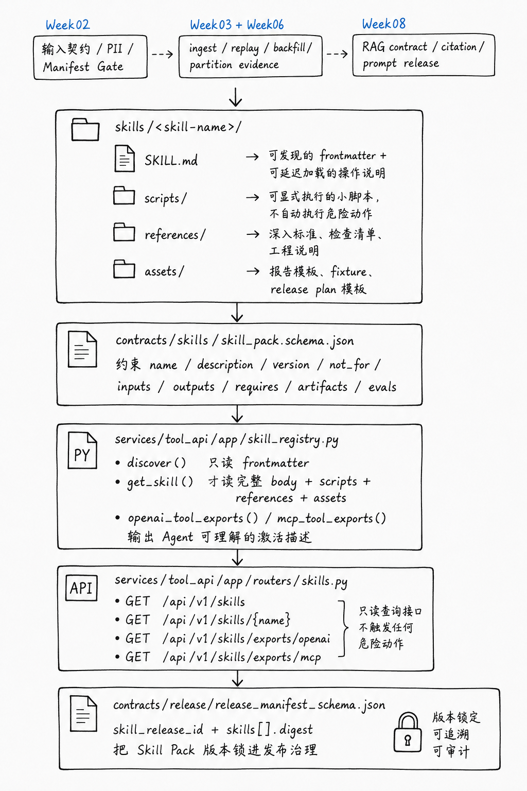

# Week09 Agent Skills Runbook

## Code Architecture Map



Read this map before running the commands below. Week09 is not a new ingestion
pipeline; it packages prior weeks' repeatable engineering craft into discoverable
Agent Skill Packs:

- `skills/<skill-name>/` owns portable instructions, scripts, references, and
  templates.
- `contracts/skills/skill_pack.schema.json` keeps skill metadata stable enough
  for registry discovery.
- `services/tool_api/app/skill_registry.py` implements progressive loading:
  discover frontmatter first, load full bodies and artifacts only when a skill is
  activated.
- `services/tool_api/app/routers/skills.py` exposes read-only query endpoints
  for skills and OpenAI/MCP-compatible exports.
- `contracts/release/release_manifest_schema.json` binds skill digests into
  release governance so skill packs become traceable release artifacts.

## Inspect Skill Packs

```bash
find skills -maxdepth 2 -type f | sort
```

Expected: five initial skills, each with `SKILL.md`, `scripts/`,
`references/`, and `assets/`.

## Run Contract Checks

```bash
pytest tests/contract/test_week09_skill_packs.py -v
```

Expected:

- every `SKILL.md` frontmatter validates against
  `contracts/skills/skill_pack.schema.json`;
- release manifest accepts optional skill bindings.

## Run Registry Checks

```bash
pytest tests/integration/test_week09_skill_registry.py -v
```

Expected:

- discovery returns metadata only;
- activation loads one skill body on demand;
- OpenAI and MCP exports include strict schemas;
- Tool API routes respond under `/api/v1/skills`.

## Local Tool API Smoke

```bash
SKILL_REGISTRY_PATH="$PWD/skills" PYTHONPATH=services/tool_api \
  uvicorn app.main:app --host 127.0.0.1 --port 8001
```

Then:

```bash
curl http://127.0.0.1:8001/api/v1/skills
curl http://127.0.0.1:8001/api/v1/skills/rag-contract-check
curl http://127.0.0.1:8001/api/v1/skills/exports/openai
curl http://127.0.0.1:8001/api/v1/skills/exports/mcp
```

## Classroom Explanation

Start from the folder shape:

```text
skills/<skill-name>/
  SKILL.md
  scripts/
  references/
  assets/
```

Then show Tool API progressive loading. The main distinction:

- Skill Pack: portable instructions and craft.
- Tool Contract: executable business action boundary.
- MCP/OpenAI export: adapter layer for discovery and activation.
