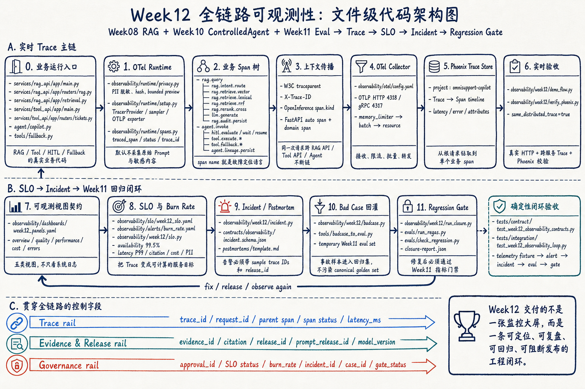

# Week12 Full-Path Observability Runbook

Week12 has two acceptance paths. Run both from the repository root.

- Live path: real HTTP requests, distributed trace propagation, Collector, Phoenix.
- Closure path: SLO alert, incident, postmortem, Week11 regression case and gate.

## Architecture Map



Before running the commands, use the upper lane to locate the live trace path
and the lower lane to locate the deterministic governance closure. The file
paths in the diagram match the modules exercised by this runbook.

## 1. Start the Real Runtime

```bash
docker compose --env-file infra/env/.env.local -f infra/docker-compose.yml up -d --build \
  postgres minio phoenix otel_collector rag_api tool_api
```

Podman users run the same service list with `podman compose`.

Check status:

```bash
docker compose --env-file infra/env/.env.local -f infra/docker-compose.yml ps
curl -fsS http://localhost:8000/health
curl -fsS http://localhost:8001/health
curl -fsS http://localhost:6006/healthz
```

Expected: both APIs and Phoenix are healthy. Collector logs contain
`Everything is ready` and no continuing Phoenix connection failures.

## 2. Validate Week12 Contracts

```bash
docker compose --profile tools --env-file infra/env/.env.local -f infra/docker-compose.yml run --rm devbox \
  pytest tests/contract/test_week12_observability_contracts.py -v
```

This checks the incident schema, five dashboard panels, SLO objectives, alert
rules, and required span names.

## 3. Emit and Verify One Distributed Trace

```bash
docker compose --profile tools --env-file infra/env/.env.local -f infra/docker-compose.yml run --rm devbox \
  sh -lc '
    python -m observability.week12.demo_flow > /tmp/week12-demo.json
    cat /tmp/week12-demo.json
    TRACE_ID=$(python -c "import json; print(json.load(open(\"/tmp/week12-demo.json\"))[\"trace_id\"])")
    python -m observability.week12.verify_phoenix --trace-id "$TRACE_ID"
  '
```

Expected:

- `same_distributed_trace=true`.
- Phoenix verification reports `status=pass`.
- The same trace contains `omni.demo.flow`, RAG spans, and Tool API spans.

Open `http://localhost:6006`, select project `omnisupport-copilot`, and open the
newest trace. The timeline should read from the client root through retrieval,
generation, audit, and tool execution.

## 4. Run the Incident-to-Regression Closure

```bash
docker compose --profile tools --env-file infra/env/.env.local -f infra/docker-compose.yml run --rm devbox \
  python -m observability.week12.run_closure \
    --output-dir reports/week12
```

Expected:

- Alerts include `copilot_availability_burn_fast`.
- A postmortem is generated under `reports/week12/postmortems/`.
- A temporary eval set and fixed prediction are generated under
  `reports/week12/regression/`.
- `eval_gate.status=pass` and `closure-report.json` reports `status=pass`.
- The canonical `evals/sets/rag_qa_golden_v2_3_0.jsonl` is unchanged.

Inspect the result:

```bash
docker compose --profile tools --env-file infra/env/.env.local -f infra/docker-compose.yml run --rm devbox \
  python -c 'import json; print(json.dumps(json.load(open("reports/week12/closure-report.json")), indent=2, ensure_ascii=False))'
```

## 5. Run Week12 Tests

```bash
docker compose --profile tools --env-file infra/env/.env.local -f infra/docker-compose.yml run --rm devbox \
  pytest \
    tests/contract/test_week12_observability_contracts.py \
    tests/integration/test_week12_observability_loop.py \
    -v
```

## 6. Regression Check for Week08-11

```bash
docker compose --profile tools --env-file infra/env/.env.local -f infra/docker-compose.yml run --rm devbox \
  pytest \
    tests/contract/test_week8_rag_contracts.py \
    tests/contract/test_week09_skill_packs.py \
    tests/contract/test_week10_controlled_agent_contracts.py \
    tests/contract/test_week11_eval_contracts.py \
    tests/integration/test_week8_rag_api.py \
    tests/integration/test_week09_skill_registry.py \
    tests/integration/test_week10_controlled_agent.py \
    tests/integration/test_week11_evaluation_system.py \
    -v
```

## Availability Fast Burn

1. Read `sample_trace_ids` from the alert context.
2. Open those traces in Phoenix and compare `rag.retrieve.*`, `llm.generate`,
   `tool.execute.*`, and `hitl.wait` latency/status.
3. Check Day-over-Day before choosing rollback or hotfix.
4. Link the mitigation to the incident ID and release ID.

## PII Redline

1. Treat any positive count as P0; do not wait for a burn-rate window.
2. Disable content capture and isolate the affected trace store.
3. Identify the producer span and rotate exposed credentials if applicable.
4. Preserve hashes and audit metadata, not the sensitive payload.

## Troubleshooting

| Symptom | Cause | Action |
| --- | --- | --- |
| `trace_not_found` | Batch export has not flushed or project name differs | Retry, check Collector logs, confirm `OTEL_PROJECT_NAME` |
| RAG and Tool return different trace IDs | `traceparent` was not propagated | Run `demo_flow.py`; do not call the two APIs manually without injected headers |
| Phoenix is empty | API image still uses the old requirements/code | Rebuild `rag_api tool_api`; check OTLP endpoint is `http://otel_collector:4318` |
| Collector logs connection refused | Collector started before Phoenix became ready | Use the Week12 compose dependency/healthcheck and recreate both services |
| Closure gate fails | Fixed prediction or expected evidence is incomplete | Inspect the new Week11 case metrics before closing the incident |
| Orphan container warning | A service from an older compose file is still running | It is not a test failure; remove it only when that service is no longer needed |
